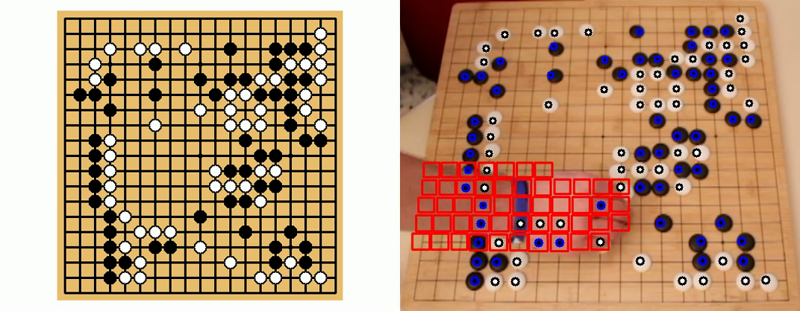

# Go-CamRecorder

Go-CamRecorder is a multiplatform recording tools based on OpenCV and the Omiscid Middleware written in C++.
It records Go games into sgf files using a simple Webcam or a Kinect on Linux/Windows (Tests were not done on MacOSX).
For the first version, only the Kinect1 device on Windows is supported. Plan for next version is to include Kinect1 and Kinect2,
on both Linux and Windows. 

# Known issues
## Technical issues
-	Some problems with Webcams occur with OpenCV on Linux. We managed to make kernel panics reading widespread USB webcam with OpenCV.  
-	For the moment, Kinect1 devices are supported only on Windows. Kinect2 support on Linux and Windows will be added later.
-	Obviously, the software works better if the goban is parallel to the camera plane.  Nevertheless, the software supports angle while stones do not hide too much each other in the camera view.

## Algorithm issues
-	Main issue concerns white stone detection. Goban can have huge reflections that are considered as White stones (due to camera white balancing). During beta tests, thresholding solved this problem. While testing in the wild at [the European Youth Go Championships 2017](http://eygc2017.jeudego.org/), neon lights produce such reflection. Several strategies prevent from false positive but leads to non-detection of white stones. Some work must be done to tackle this issue (you are welcome to contribute!). Black detection work fine.
-	Using webcam, if someone with a black (or white) pullover stays still for too long over the goban, stones will be detected.
-	Stones are not always detected in the right order, more over when players act quickly and hide stones while playing. 
-	SGF files contain only new moves, i.e. appearing stones. Disappeared stones are not included in the file: they are inferred from captures. The current strategy to aggregate new moves into SGF does not allow to remove false detection even if the software detection them afterward. This strategy must be improved.

## Building the program

### Requirements

#### *ffmpeg*

You must install [ffmpeg](https://www.ffmpeg.org/) version 2.4.7 (or later) to your computer in a way you can call `ffprobe` and `ffmpeg` from
the command line. For older version, please read KnownIssues.md.
In a command shell (even in the standard cmd.exe shell on Windows), you can test `ffprobe` and `ffmpeg` to see if it is working.

    $> ffprobe --version  
    $> ffmpeg --version

#### *OpenCV*

You **DO NOT** need to recompile OpenCV to support specific codecs. You just need to install it. This source code
was tested with OpenCV 2.4.10 (Linux/Windows/Mac OSX) and 3.0.0 (on Windows only for this last version.) Please see the [OpenCV web site](http://opencv.org).

#### *cmake*

In all environment, you must install cmake (2.8 or later).

#### *git*

In all environment, you must install git. It must be callable from the sandatd shell (as `ffmpeg`). You could try:

    $> git --version  

#### *Visual Studio (Windows users Only)*

On Windows, you must install Visual Studio 2013 (Express, for the free version) or later.

### Linux/Mac OSX compilation

On these environments, you need to call `cmake` to create the make file within this folder:

    $> cmake .

After these step is complete, you can call make:

    $> make

### Windows compilation

You must first create a visual studio solution for the program. On Windows, you must specify the location of your OpenCV build folder invoking `cmake` with parameters:

    $> cmake . -DOpenCV_FIND_QUIETLY:BOOLEAN=FALSE -G "Visual Studio 12 Win64" "-DOpenCV_DIR:STRING=PATH_TO_YOUR_OPENCV\\opencv\\build"

It will produce a complete solution named `Go-CamRecorder.sln`. You can open it in order to compile the program.

## Short explanation

The current version of Go-CamRecorder works on an association with a camera/kinect and a goban. Up to now, the goban must not move
during recording. After a quick camera calibration phase, the software can track stones and produces an SGF file.
To do so, it computes artificial projection of stones all over the goban and creates for each one a so-called StoneDetector.

Go-CamRecorder can handle 9x9, 13x13 or 19x19 gobans. 
The size limitation is done while parsing program arguments. 
Actually, the source code can process every square goban with a size > 5.

### Calibration

The calibration phase consists in computing camera parameters. Placing 17 points on the image permits to compute projection parameters.
Stone in 3D can be projected in 2D camera space to place and size every stone detector on the goban.
The following images show how to placement of the 17 points on the goban. The [_aa_] position is in the left upper corner.

After computation of camera parameters, Go-CamRecorder shows the result to the user for validation. On the next image, blue spots
represent centers of stone detectors, the blue area is the processing zone.

 

Calibration results are stored. If the camera/goban position does not change, there is no need to redo calibration.

### Online processing

During online processing, the first step is to detect motion. Motion is detected by image change when using webcam.
It is done by background detection when using Kinect. When motion is detected, stones are searched on the goban.
Next images depict stone detectors over the goban, black detection and white detection.

#### Stone detectors

#### Black detection
 
#### White detection
 

## Examples

Here is a screen capture of Go-CamRecorder while processing 
a Game (thank you to the player/recorder of this session). At left, you can see the goban state as detected
using computer vision by Go-CamRecorder 1.0a. At right, the processing frames captured using a webcam. There is an integration time between both views. It permits to deal with false stone detection, false stone loss, etc. Red squares represent motion detection on each stone detector on the goban. Black ellipses with blue border are detected black stones; white ellipses with black border are white detected stones. When visual perception failed, for instance when an arm hides a move and thus stones are detected in the wrong order, a comment is inserted in the SGF file to help humans correct the SGF file.

.

Examples can be found on the [Go-CamRecorder YouTube channel](https://www.youtube.com/channel/UCmsQVrwGb3ARL4KsHE5NVpA).
The [SGF file produced by Go-CamRecorder from this video is available in the SGF_Examples folder of the repo](https://github.com/Vaufreyd/Go-CamRecorder/blob/master/SGF_Examples/2017-02-16.17-20_2612040790.sgf).

